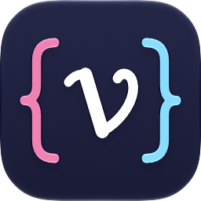
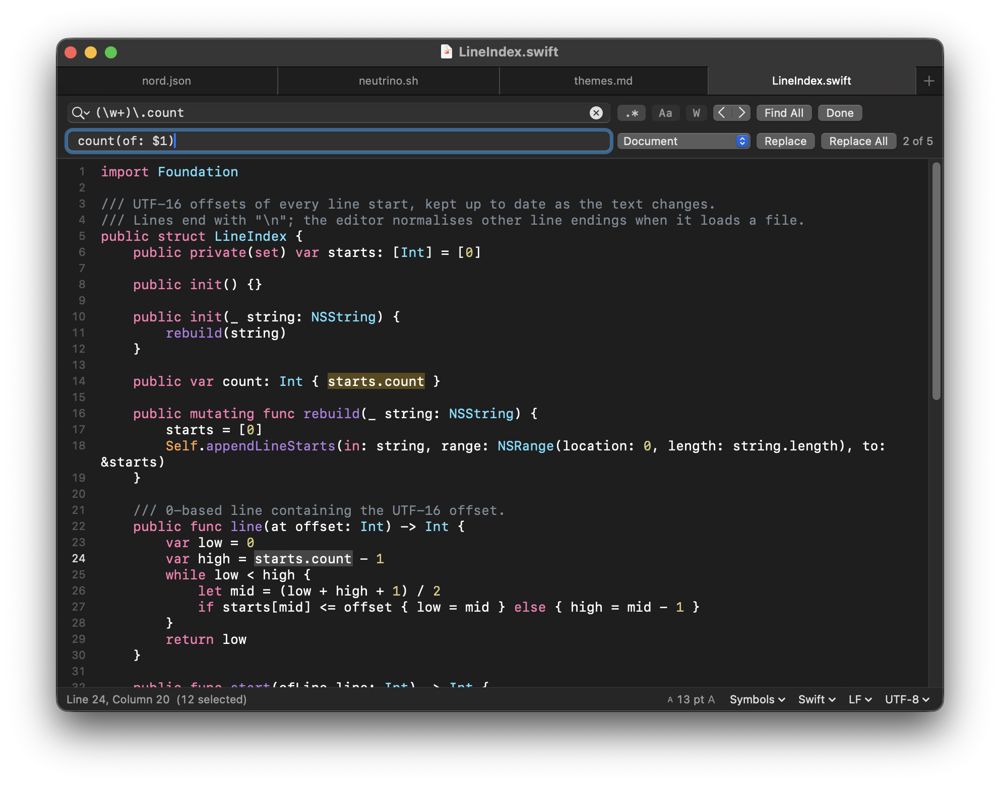

<p align="center">
  
</p>

<h1 align="center">Neutrino</h1>

<p align="center">A small code editor for the Mac. Tabs, syntax colouring and regex find and replace. Free and open source.</p>

<p align="center">
  
</p>

## Features

**Editing**
- Tabs, using the standard macOS window tabs: drag to reorder, drag out to a new window, <kbd>⌘</kbd><kbd>T</kbd> for a new one
- Line numbers, line wrapping, current line highlight, invisible characters
- Indentation is kept on new lines; brackets and quotes are closed as you type
- Spaces or tabs, with any tab width. Makefiles and Go files always use tabs
- Shift lines left and right (<kbd>⌘</kbd><kbd>[</kbd> / <kbd>⌘</kbd><kbd>]</kbd>), comment and uncomment (<kbd>⌘</kbd><kbd>/</kbd>), go to line (<kbd>⌘</kbd><kbd>L</kbd>)
- A file's encoding, byte order mark and line endings are kept when saving. Change them, or reopen with another encoding, from the status bar
- Changes are saved automatically a few seconds after you stop typing and when you switch to another window or app. macOS keeps earlier versions (**File → Revert to Saved**)
- With **Settings → General → Save changes automatically** off, files are only written when you save. Unsaved text is still recovered after a crash
- Files changed by another app are reloaded when there are no unsaved changes
- Optionally remove trailing spaces and end the file with a line break when saving
- Light, dark or system theme

**Find and replace** (<kbd>⌘</kbd><kbd>F</kbd>)
- Plain text or regular expressions, match case, whole words
- Matches are highlighted and counted as you type
- Search the document, the selection, or all open documents
- **Find All** lists every match with its line; click one to go there. **Copy Matches** copies the matched text
- **Replace All** is a single undo step
- In regex replacements: `$1` or `\1` for groups, `${name}` for named groups, `$0` for the whole match, `\U…\E` and `\L…\E` to change case, `\u` and `\l` for one character, `\n` and `\t`
- Recent searches in the search field's menu

**Syntaxes**
- None are built in. Install the ones you use from **Settings → Syntaxes** or from the syntax menu in the status bar
- A syntax is loaded when a document uses it and unloaded when the last such document closes
- Available: C, C++, C#, CSS, Diff, Dockerfile, Go, HTML, INI, Java, JavaScript, JSON, Kotlin, Lua, Makefile, Markdown, PHP, Python, Ruby, Rust, Shell, SQL, Swift, TOML, TypeScript, XML, YAML
- A syntax is one JSON file. See [docs/syntaxes.md](docs/syntaxes.md) to write your own

**Other**
- `neutrino` command: `neutrino main.c notes.txt` or `git diff | neutrino`
- Reopens the documents from the last session
- Weekly check for new versions on GitHub (can be turned off)

Files above 4 million characters open without colours.

## Install

### Homebrew

```bash
brew install --cask rboundi/tap/neutrino
```

### Download

Download [Neutrino.dmg](https://github.com/rboundi/neutrino/releases/latest/download/Neutrino.dmg), open it and drag Neutrino to Applications. The app is signed and notarized by Apple.

### Build from source

Requires macOS 13 or later and the Xcode Command Line Tools (`xcode-select --install`). With full Xcode installed, the build also includes Intel.

```bash
git clone https://github.com/rboundi/neutrino.git
cd neutrino
./build.sh --install
```

This installs the app to `/Applications` and links the `neutrino` command into `/opt/homebrew/bin` or `/usr/local/bin` if one is writable. The command can also be installed from **Neutrino → Install Command Line Tool…**.

## Keyboard shortcuts

| Action | Shortcut |
|---|---|
| New / Open | <kbd>⌘</kbd><kbd>N</kbd> / <kbd>⌘</kbd><kbd>O</kbd> |
| New tab | <kbd>⌘</kbd><kbd>T</kbd> |
| Save / Save As | <kbd>⌘</kbd><kbd>S</kbd> / <kbd>⇧</kbd><kbd>⌘</kbd><kbd>S</kbd> |
| Close tab | <kbd>⌘</kbd><kbd>W</kbd> |
| Next / previous tab | <kbd>⌃</kbd><kbd>Tab</kbd> / <kbd>⌃</kbd><kbd>⇧</kbd><kbd>Tab</kbd> |
| Find and Replace | <kbd>⌘</kbd><kbd>F</kbd> |
| Find next / previous | <kbd>⌘</kbd><kbd>G</kbd> / <kbd>⇧</kbd><kbd>⌘</kbd><kbd>G</kbd> (or <kbd>Return</kbd> / <kbd>⇧</kbd><kbd>Return</kbd> in the search field) |
| Find All | <kbd>⌃</kbd><kbd>⌘</kbd><kbd>F</kbd> |
| Use Selection for Find | <kbd>⌘</kbd><kbd>E</kbd> |
| Go to Line | <kbd>⌘</kbd><kbd>L</kbd> |
| Shift left / right | <kbd>⌘</kbd><kbd>[</kbd> / <kbd>⌘</kbd><kbd>]</kbd> |
| Comment or uncomment | <kbd>⌘</kbd><kbd>/</kbd> |
| Bigger / smaller / default text size | <kbd>⌘</kbd><kbd>+</kbd> / <kbd>⌘</kbd><kbd>-</kbd> / <kbd>⌘</kbd><kbd>0</kbd> |
| Settings | <kbd>⌘</kbd><kbd>,</kbd> |

## Privacy

Neutrino connects to `raw.githubusercontent.com` to list and download syntaxes when you open **Settings → Syntaxes** or install one, and to `github.com` to check for new versions once a week. The update check can be turned off in Settings. There is no analytics or telemetry.

## Project layout

```
Sources/NeutrinoCore/           No UI, covered by tests
  Syntax.swift                  Syntax files and the tokenizer
  Search.swift                  Search, replacement templates, replace all
  TextCodec.swift               Encodings and line endings
  LineIndex.swift               Line starts, kept up to date across edits
Sources/Neutrino/
  main.swift, AppDelegate.swift App entry, launch and quit
  MainMenu.swift                Menu bar
  Document.swift                An open file: reading, writing, reloading
  EditorWindowController.swift  Window layout, colours, settings
  EditorFind.swift              Find and replace
  EditorTextView.swift          Text view, invisibles, line numbers
  FindBar.swift                 Find bar and the Find All list
  StatusBar.swift               Status bar and its menus
  SyntaxStore.swift             Installing, loading and unloading syntaxes
  SettingsView.swift            Settings window
  UpdateChecker.swift           Release check
syntaxes/                       Published syntax files and their index
Resources/                      Info.plist, icon, the neutrino command
scripts/                        Icon generator, syntax index, release script
Tests/                          Tests for NeutrinoCore and every syntax file
```

The app is AppKit with TextKit 1, with no third-party packages. Colours are applied only to the text on screen.

## Development

```bash
./build.sh                    # builds build/Neutrino.app
open build/Neutrino.app
swift test                    # needs Xcode
```

See [CONTRIBUTING.md](CONTRIBUTING.md) for adding syntaxes and for releases.

## License

MIT. See [LICENSE](LICENSE).
